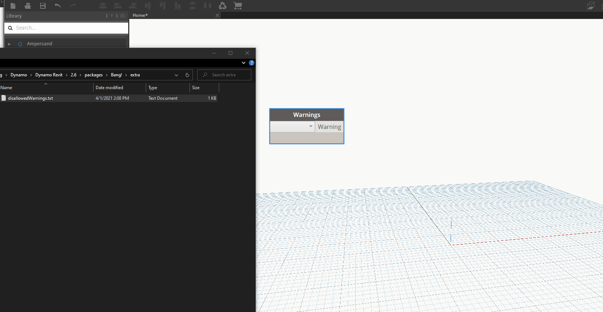

## Using the "Disallow Warnings" Functionality

By default, Bang!, displays **all** warnings in the active Revit document. Most of the time this is okay, but sometimes we want to not deal with some of the ones we can ingore.

Rather than hardcode the warnings we want to ignore, you have the ability to specify text of warnings you would rather ignore.

---
### DisallowWarnings.txt

The disallow warnings file is located in the "extra" folder in the Bang package directory.

It is a simple text file, that takes comma-separated values. _(Case and spaces will be removed, so it doesn't matter if you type that or not. 🤷‍♂️)_

and here it is in action:
